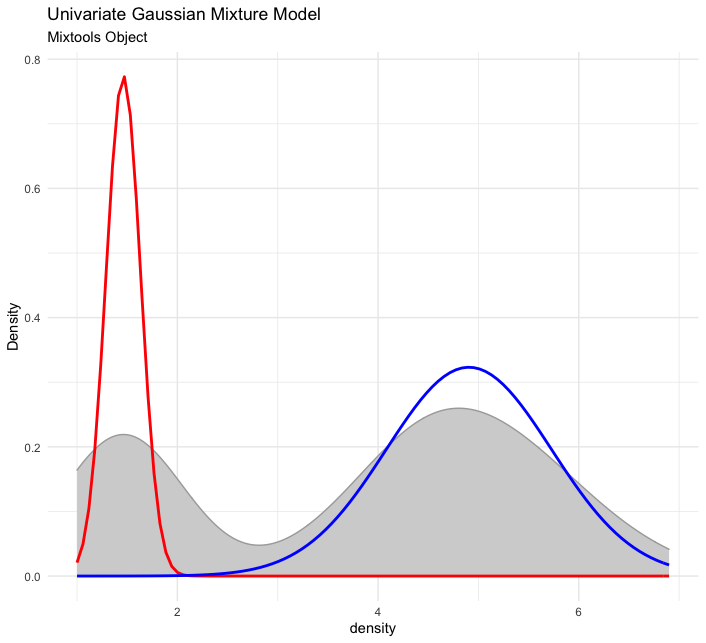
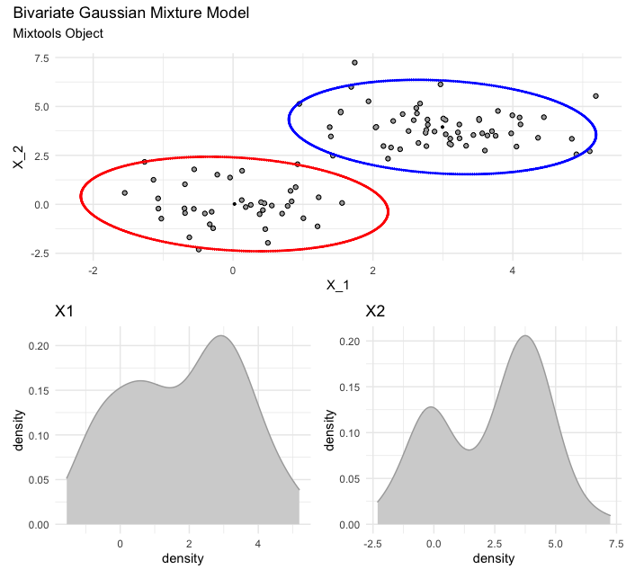
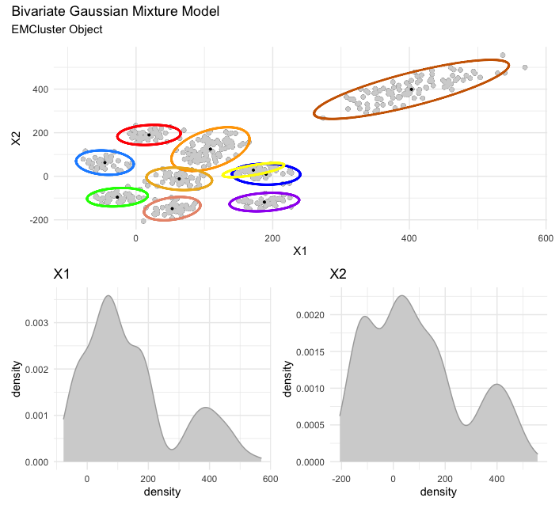
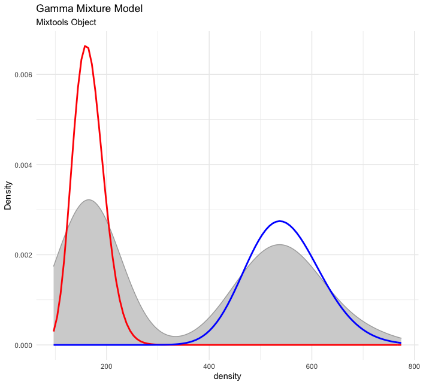
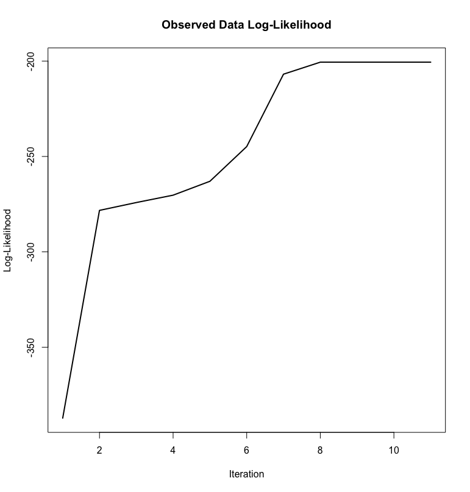
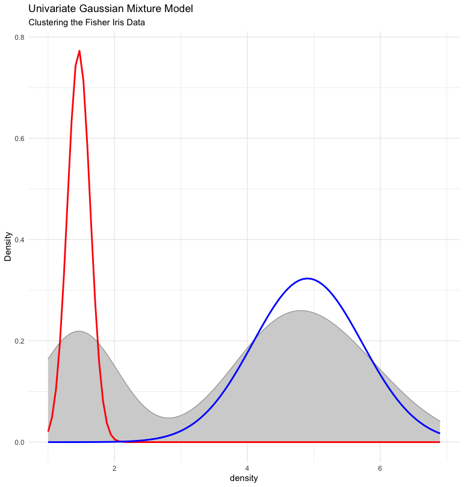

# User Interface Demonstration of `plotmm`

Our mixture model visual toolbox includes several tidy functions that allow for streamlined and clean production of mixture model visualizations. The core functions are `plot_mm()`, `plot_cut_point()`, and `plot_mix_comps()`, though others are also available in the package. As noted in the package documentation, other "non-core" functions are included mostly to bridge between the more constrained predecessor package, `plotGMM`, and the currently vastly expanded package, `plotmm` detailed herein. In this demo, we walk users through the main functions using both real and simulated data.

### `plot_mm()`

The `plot_mm()` function is the core of the package, and plots the density of the data space with overlaid component curves for `k` components from the fit mixture model. The package supports the previously identified models mostly from the `mixtools` package, with some support for `EMCluster` and `flexmix` model objects. *Note*: as the package is under active development, though stably released, we anticipate much wider support for more model objects and specifications in near-future versions of the package.

For use, users simply pass the model object to the first argument, as well as an optional argument for the number of components `k` to the second argument. Users visualizing `EMCluster` objects must also pass the name of the data frame to the function. Importantly, as the second argument, `k`, is optional, the function will automatically detect the number of clusters based on the supplied model object. The result is a high-quality visualization of the data space and overlaid estimated component curves. 

For example, see a simple case with a univariate Gaussian mixture model using Fisher's Iris dataset:

Now, consider a bivariate Gaussian case from both `mixtools` and `EMCluster` in the following two figures. Each are for different sample datasets. Note that the bivariate cases incorporate two features, which the package treats jointly as well as independently. All three figures are rendered in a single plot. There are additional options and functions to layer to change the ordering, labels, colors, spacing, and so on if so desired. 

Also, other non-normal distributions are also supported such as the gamma distribution previously discussed:

### `plot_cut_point()`

Mixture models can also be used to derive cut points in some data space, which is the point of greatest separation between the clusters. The `plot_cut_point()` function allows the user to plot these cut points from mixture models. 

Similar to `plot_mm()`, users simply pass a model object to the function's first argument, with a second argument allowing for an optional plot, with the default option set to `TRUE`. If `plot = FALSE`, only the numeric value of the cut point is computed and returned. 

Though more custom color options are possible through layering additional functions as previously discussed, there is a built in set of color palettes allowing the user to locally change colors. This third argument, `color`, includes three options: an interpolated scale from blue to red via the `amerika` package, the "Rushmore1" palette via the `wesanderson` package, and a grayscale default option. All of these color options, as well as a demonstration of the ease of adding custom labels and changing default settings are included in the following figure using the Old Faithful data.

### `plot_mix_comps()`

Finally, the package includes a powerful helper function, `plot_mix_comps()`, to allow for further customization of visual mixture model output. This function is also used in the core `plot_mm()` function. The `plot_mix_comps()` function works by computing and then constraining the parameters that are overlaid. This function is powerful because it is flexible to accommodate *any* mixture model object, not just those from the `mixtools`, `EMCluster}`, or `flexmix` packages. The result is custom, publication-ready plot, though more code is needed for a custom plot than required of the main `plot_mm()` function. For example, most common use of this function in custom applications would be passing it to the `fun` argument within the `stat_function()` function in a `ggplot` function call. The result of this type of application is shown below:

### Comparison to Other Packages

The value of the package can also be seen in direct comparison with plotting options from existing packages. For example, the first figure following is using the `plotem()` function from the `EMCluster` package, and the next figure is using our tidy `plot_mm()` approach for a more elegant rendering of the same configuration.

As a final comparison, we compare our approach to the `mixtools` plotting options. The default plotting option for a univariate Gaussian mixture model fit via `mixtools` is to plot the log-likelihood over each iteration of the model (given that the EM algorithm is iterative). While valuable information, this base plotting option is not intuitive, nor is it substantively useful in visually presenting results from the fit mixture model. Further, the plot is in base R, which is less visually appealing. See this plot for the clustering configuration for the Fisher Iris data set below: 

Our approach plots the observed data density with the estimated component curves overlaid. This is a much more straightforward, intuitive, and visually appealing look at the results from the same model. 

